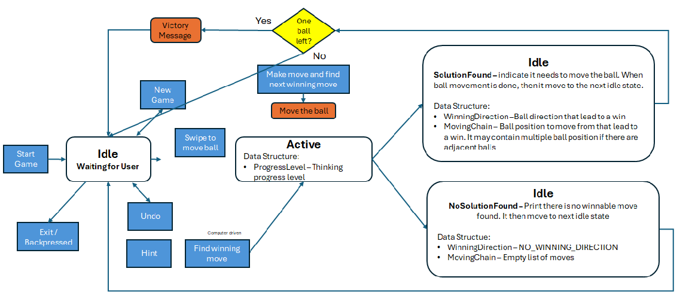

**SolverViewModel State Machine**

**Game State Machine**

**Solver State Machine**

Solver Game UI Control Action Mapping table

| UI Control Object                    | NoMoveAvailable | Thinking   | ReadyToFindSolution | HasWinningMoveWaitingToMove | AnnounceNoPossibleSolution (transient) | AnnounceVictory (transient) | MoveBall (transient) |
|--------------------------------------|-----------------|------------|---------------------|-----------------------------|----------------------------------------|-----------------------------|----------------------|
| "Find Solution" button               | Disabled        | Disabled   | Enabled             | Disabled                    | Disabled                               | Disabled                    | Disabled             |
| "Move and find next Solution" button | Disabled        | Disabled   | Disabled            | Enabled                     | Disabled                               | Disabled                    | Disabled             |
| "Reset" button                       | Enable          | Disabled   | Enabled             | Enabled                     | Disabled                               | Disabled                    | Disabled             |
| Toggle position game board           | Enable          | Disabled   | Enabled             | Enabled                     | Disabled                               | Disabled                    | Disabled             |
| Swipe action on game board           | Blocked         | Blocked    | Blocked             | Blocked                     | Disabled                               | Disabled                    | Disabled             |
| Exit from screen activity            | Enabled         | User check | Enabled             | Enabled                     | Disabled                               | Disabled                    | Disabled             |